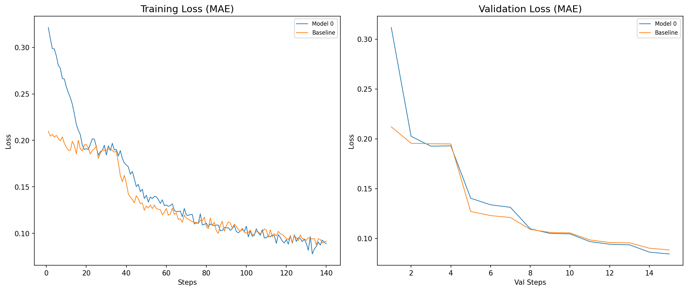

# Early Audio AutoEncoder Hypothesis Test

_I tested a new encoder architecture against a standard 1D convolutional baseline on raw audio waveform reconstruction._

> [!NOTE]
> The internal design of the new autoencoder is omitted from this public repository. The training setup, the baseline implementation, and the results are fully disclosed below.

## Setup

Both models share exactly the same decoder and the same overall design philosophy: SiLU activations, tiny inceptions that refine the output of each downsampling layer, and a final `tanh` output.
The baseline was given **more channels** intentionally to its encoder to give it a capacity advantage over the new design.

- **Task**: raw 1D waveform reconstruction
- **Training**: 5 epochs, same optimizer, lr=3e-4, batch_size=32, L1Loss, same for both models
- **Hardware**: CPU (Ryzen 7 5100U)

### Model sizes

| Model     | Parameters (approx.) | Effective temporal receptive field | Training Peak Memory |
|-----------|----------------------|------------------------------------|----------------------|
| New model | ~31 k                | around ~130                        | ~0.97                |
| Baseline  | ~48 k                | around ~180                        | ~1.19                |

Training peak memory = inference activations + parameters + gradients (same size as parameters). Optimizer states are not included. N = 2048

The new model is about **17% lighter in activations** and **35% smaller in parameters** while still reaching a lower validation loss.

## Results

The new model reaches a lower validation loss, despite having **35% fewer parameters**, a **smaller receptive field** and being a little unstable, a result that contradicts the default assumption that more capacity and wider context are always better for audio data.



### Validation loss per epoch(At the end of each epoch)

| Epoch | Baseline  | New model |
|-------|-----------|-----------|
| 0     | 0.1950    | 0.1926    |
| 1     | 0.1230    | 0.1338    |
| 2     | 0.1061    | 0.1051    |
| 3     | 0.0959    | 0.0942    |
| 4     | **0.0885**| **0.0844**|

**The baseline starts stronger in the first epoch but is overtaken by the new model, which finishes with a clear margin.**

## Baseline And New Model
The baseline encoder is a pure 1D convolutional stack with progressively wider layers. It's the standard approach typically applied to raw audio.

```python
class AutoEncoderBaseline(nn.Module):
    def __init__(self):
        super().__init__()

        # Encoder
        self.c1 = nn.Conv1d(1, 4, kernel_size=7, stride=2, padding=3)
        self.c2 = nn.Conv1d(1, 4, kernel_size=3, stride=2, padding=1)

        self.c3 = nn.Conv1d(8, 12, kernel_size=5, stride=1, padding='same')
        self.c4 = nn.Conv1d(8, 12, kernel_size=3, stride=1, padding='same')

        self.c5 = nn.Conv1d(24, 28, kernel_size=5, stride=2, padding=2)

        self.c6 = nn.Conv1d(28, 16, kernel_size=5, stride=1, padding='same')
        self.c7 = nn.Conv1d(28, 16, kernel_size=3, stride=1, padding='same')

        self.c8 = nn.Conv1d(32, 36, kernel_size=5, stride=2, padding=2)

        self.c9 = nn.Conv1d(36, 21, kernel_size=5, stride=1, padding='same')
        self.c10 = nn.Conv1d(36, 21, kernel_size=3, stride=1, padding='same')

        self.c11 = nn.Conv1d(42, 46, kernel_size=5, stride=2, padding=2)

        self.c12 = nn.Conv1d(46, 28, kernel_size=5, stride=1, padding='same')

        # Decoder – identical to the new model
        self.u11 = nn.Upsample(scale_factor=2, mode='nearest')
        self.d11 = nn.Conv1d(28, 24, 5, padding=2)
        self.d10 = nn.Conv1d(24, 16, 3, padding='same')
        self.u8 = nn.Upsample(scale_factor=2, mode='nearest')

        self.d8 = nn.Conv1d(16, 28, kernel_size=3, padding='same')
        self.d7 = nn.Conv1d(28, 24, 3, padding='same')
        self.u4 = nn.Upsample(scale_factor=2, mode='nearest')
        self.d4 = nn.Conv1d(24, 20, 5, padding=2)
        self.d3 = nn.Conv1d(20, 12, 5, padding='same')

        self.d2 = nn.ConvTranspose1d(12, 6, 7, stride=1, padding=3)
        self.u1 = nn.Upsample(scale_factor=2, mode='nearest')
        self.d1a = nn.Conv1d(3, 1, 7, padding=3)
        self.d1b = nn.Conv1d(3, 1, 3, padding=1)

    def forward(self, x):
        x = x.unsqueeze(1)

        x = torch.cat([self.c1(x), self.c2(x)], dim=-2)
        x = torch.cat([self.c3(x), self.c4(x)], dim=-2)
        x = F.silu(self.c5(x))
        x = F.silu(torch.cat([self.c6(x), self.c7(x)], dim=-2))
        x = F.silu(self.c8(x))
        x = F.silu(torch.cat([self.c9(x), self.c10(x)], dim=-2))
        x = F.silu(self.c12(F.silu(self.c11(x))))

        x = F.silu(self.d11(self.u11(x)))
        x = self.d10(x)
        x = self.u8(x)
        x = self.d8(x)
        x = F.silu(self.d7(x))
        x = F.silu(self.d4(self.u4(x)))
        x = self.d3(x)
        x = self.d2(x)

        x1, x2 = x[:, :3, :], x[:, 3:, :]
        y1 = self.d1a(self.u1(x1))
        y2 = self.d1b(self.u1(x2))

        return F.tanh(y1 + y2).squeeze(1)
```

The new model is intentionally smaller and actually it is **harder** to arrange everything properly to add more capacity and channels. My model also uses many memory operations.

The first two convolutions
```python
self.c1 = nn.Conv1d(1, 3, kernel_size=7, stride=2, padding=3)
self.c2 = nn.Conv1d(1, 3, kernel_size=3, stride=2, padding=1)
```

The last convolution
```python
self.c12 = nn.Conv1d(24, 28, kernel_size=5, stride=2, padding=2)
```
