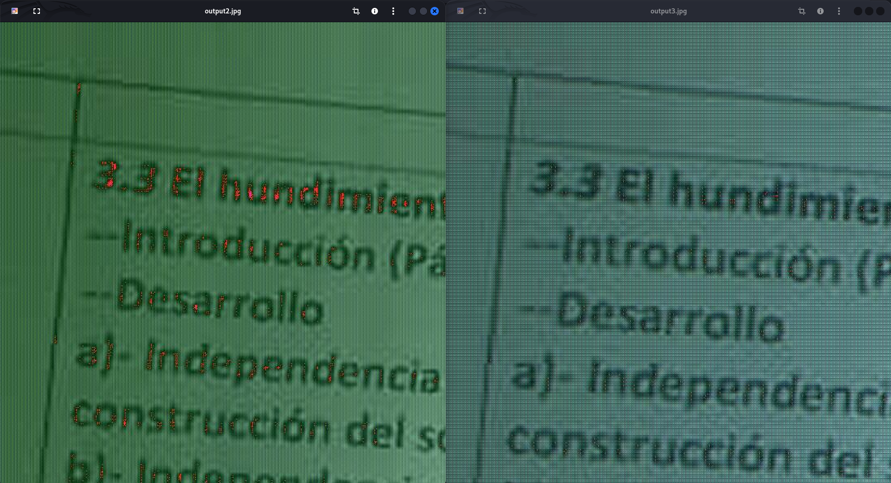
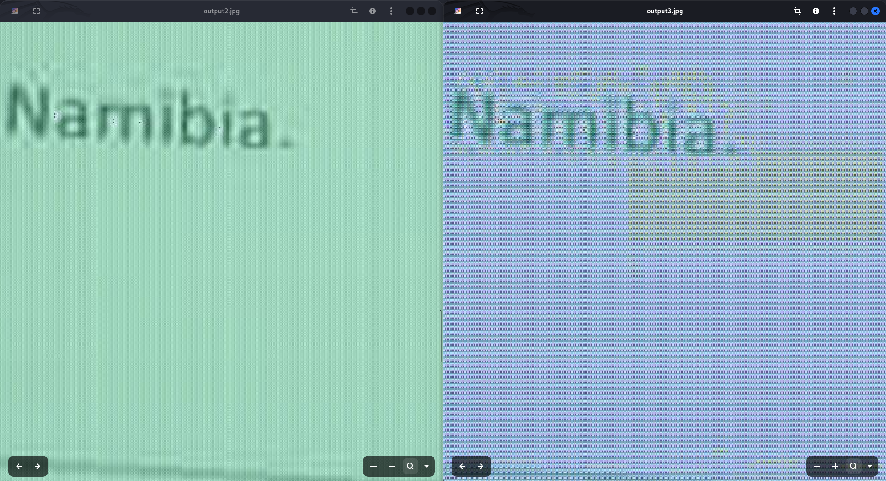
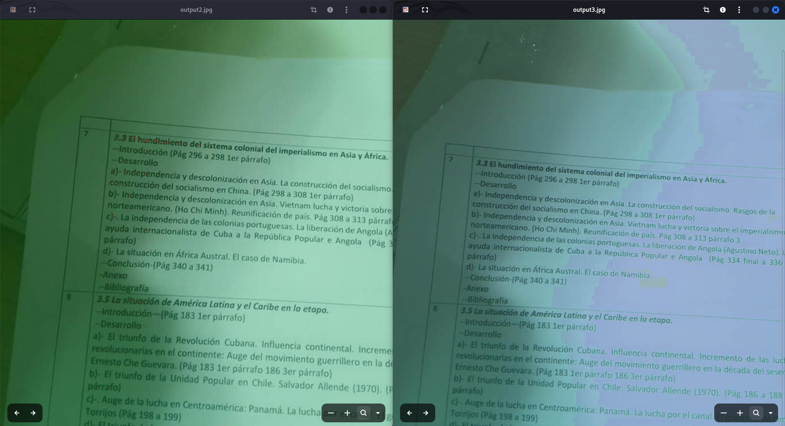
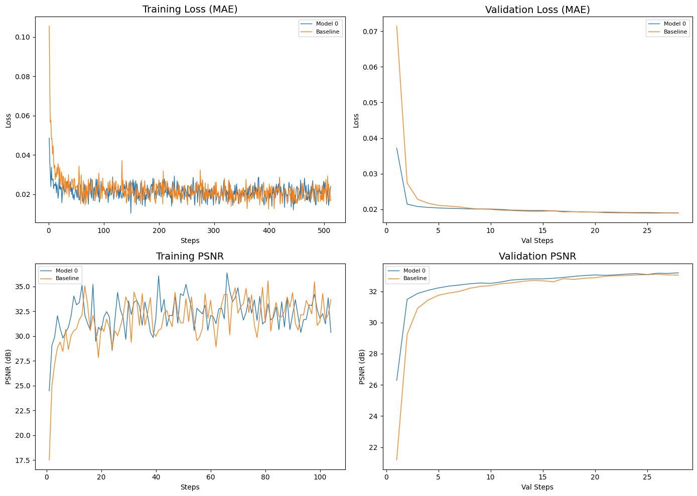

# ColorMix UpSampler
**Improved ColorMixing in CNNs for Image Super-Resolution**

## Architecture
Here the Baseline is `UpSampler2`. Both architectures are equivalent. The only change from the baseline is fewer channels in the residual blocks and the replacement of the first convolution by the ColorMix module.
> [!Note]
> The internal implementation of `ColorMix` is intentionally omitted from this public repository. The module uses two convolutions and one indexing operation, but the exact logic is not disclosed here.

```python
class UpSampler(nn.Module):
    def __init__(self, in_channels: int = 3, num_blocks: int = 1, upscale_factor: int = 2):
        super().__init__()
        self.upscale_factor = upscale_factor

        self.cmix = ColorMix(in_channels) # 3->27

        self.blocks = nn.ModuleList([
            nn.Sequential(
                nn.Conv2d(in_channels**3, (in_channels**3)-(in_channels**2), kernel_size=3, padding='same'),
                nn.SiLU(),
                nn.Conv2d((in_channels**3)-(in_channels**2), in_channels**3, kernel_size=3, padding='same')
            ) for _ in range(num_blocks)
        ])

        self.up = nn.Sequential(
            nn.Conv2d(in_channels**3, 36, kernel_size=3, groups=1, padding='same'),
            nn.PixelShuffle(upscale_factor=upscale_factor)
        )

        self.cdmix = nn.Conv2d(36//(upscale_factor**2), in_channels, kernel_size=5, padding='same')

    def forward(self, x):
        res = F.interpolate(x, scale_factor=self.upscale_factor, mode='bicubic', align_corners=False)
        x = self.cmix(x)
        for block in self.blocks:
            x = block(x)+x
        return self.cdmix(self.up(x)) + res

class UpSampler2(nn.Module):
    def __init__(self, in_channels: int = 3, num_blocks: int = 1, upscale_factor: int = 2):
        super().__init__()
        self.upscale_factor = upscale_factor

        self.cmix = nn.Conv2d(3, 32, kernel_size=5, padding='same') # 3->27

        self.blocks = nn.ModuleList([
            nn.Sequential(
                nn.Conv2d(32, 21, kernel_size=3, padding='same'),
                nn.SiLU(),
                nn.Conv2d(21, 32, kernel_size=3, padding='same'),
            ) for _ in range(num_blocks)
        ])

        self.up = nn.Sequential(
            nn.Conv2d(32, 36, kernel_size=3, padding='same'),
            nn.PixelShuffle(upscale_factor=upscale_factor)
        )

        self.cdmix = nn.Conv2d(36//(upscale_factor**2), 3, kernel_size=5, padding='same')

    def forward(self, x):
        res = F.interpolate(x, scale_factor=self.upscale_factor, mode='bicubic', align_corners=False)
        x = self.cmix(x)
        for block in self.blocks:
            x = block(x)+x
        return self.cdmix(self.up(x)) + res
```

The difference between the two architectures is already evident at initialization, even before training, when using a high-resolution image as input:





Left: Model with ColorMix,  Right: Baseline Model


This shows the Baseline has a higher tendency toward checkerboard artifacts which are clearly visible.


## Benchmark

### Dataset
I'm using the dataset generated with `stuff/dataset/SRD/dataset_gen.py` which has ~8000 samples generated from 6 videos and ~2000 images from my gallery.

### Parameters
Both models use 3 blocks:
- Model with ColorMix: 38127 Parameters
- Baseline(`UpSampler2`): 49961 Parameters

### Setup
Both models were trained with:
- batch_size: 32
- eval_interval: 20
- epochs: 3
- device: CPU (unfortunately)
- loss function: `nn.L1Loss()`
- val_samples: 192
- seed: 123
- img_size: torch.Size([3, 92, 92])
- num_samples: 8377
- cpu threads: 8
- garbage collection: enabled

### Results:
Despite having ~24% fewer parameters, the ColorMix model consistently outperforms the baseline.



> [!NOTE] When tested on the same image as the earlier examples of the output at initialization, the Structural Similarity Index Measure (SSIM) drops compared to the baseline by `~0.003`.
