# Random Character Classification Dataset (RCCD)

This is a synthetic dataset that I'm using to benchmark CNNs.

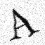 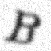 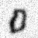 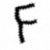 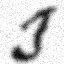 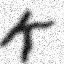 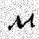 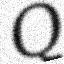 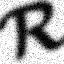 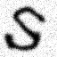 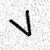 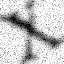 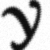

## Generation
The Dataset is Generated using PIL(Python Imagin Library), to achieve enough diversity every aspect of the image is choosen ramdomly:
- A Random Font is selected
- Random Font Size
- Random Noise
- A litle Randomness in the position of the character
- Random Elastic Distortion
- Random Gaussian Blur
- Random Rotation


### Fonts I'm Using
```python
fonts = ['/usr/share/fonts/truetype/liberation/LiberationSans-Regular.ttf', '/usr/share/windsurf/resources/app/extensions/markdown-math/notebook-out/fonts/KaTeX_Caligraphic-Bold.woff2', '/usr/share/matplotlib/mpl-data/fonts/ttf/DejaVuSerif.ttf', '/usr/share/matplotlib/mpl-data/fonts/ttf/DejaVuSerif-Italic.ttf', '/usr/share/texmf/fonts/opentype/public/lm-math/latinmodern-math.otf', '/usr/share/fonts-hack/woff2/hack-italic.woff2']
special_fonts = ['/usr/share/fonts/truetype/liberation/LiberationSans-Regular.ttf'] # This one is separately for special characters because some fonts don't include those
```

## Code
```python
def generate_image(char, size, font_path):
    font_size = random.randint(size[0]-30, size[0]+10)

    # Generate base image
    img = Image.new('L', size, color=255)
    draw = ImageDraw.Draw(img)
    font = ImageFont.truetype(font_path, font_size)

    # Generate Noise
    noise = random.uniform(0, 0.2) * np.random.randn(size[0], size[1])
    noise = np.clip(noise * 255, 0, 255)

    # Draw character
    bbox = draw.textbbox((0, 0), char, font=font)
    text_width = bbox[2] - bbox[0]
    text_height = bbox[3] - bbox[1]
    x = (size[0] - text_width) // 2 - bbox[0] + random.randint(-4, 4)
    y = (size[1] - text_height) // 2 - bbox[1] + random.randint(-4, 4)
    draw.text((x, y), char, fill=int(random.uniform(0, 32)), font=font)

    # Elastic Distortion
    if random.uniform(0, 1) > 1/4:
        alpha, sigma = 25, 5
        dx = gaussian_filter((np.random.randn(*size)), sigma, mode="wrap", cval=0) * alpha
        dy = gaussian_filter((np.random.randn(*size)), sigma, mode="wrap", cval=0) * alpha
        x, y = np.meshgrid(np.arange(size[0]), np.arange(size[1]), indexing='ij')
        indices = np.reshape(x + dx, (-1, 1)), np.reshape(y + dy, (-1, 1))
        img_array = map_coordinates(img, indices, order=1, mode='nearest', cval=0).reshape(size)
        img = Image.fromarray(img_array.astype(np.uint8))

    # Apply Gaussian Blur and Random Rotation
    img = img.filter(ImageFilter.GaussianBlur(radius=random.uniform(0.0, 3.5)))
    img = img.rotate(random.uniform(-35, 35), expand=False, fillcolor=255)

    # Apply Noise
    img_array = np.array(img, dtype=np.float32)

    return np.clip((img_array-noise), 0, 255).astype(np.uint8)
```

**Note:** _The current parameters are hardcoded for 64*64 images_
