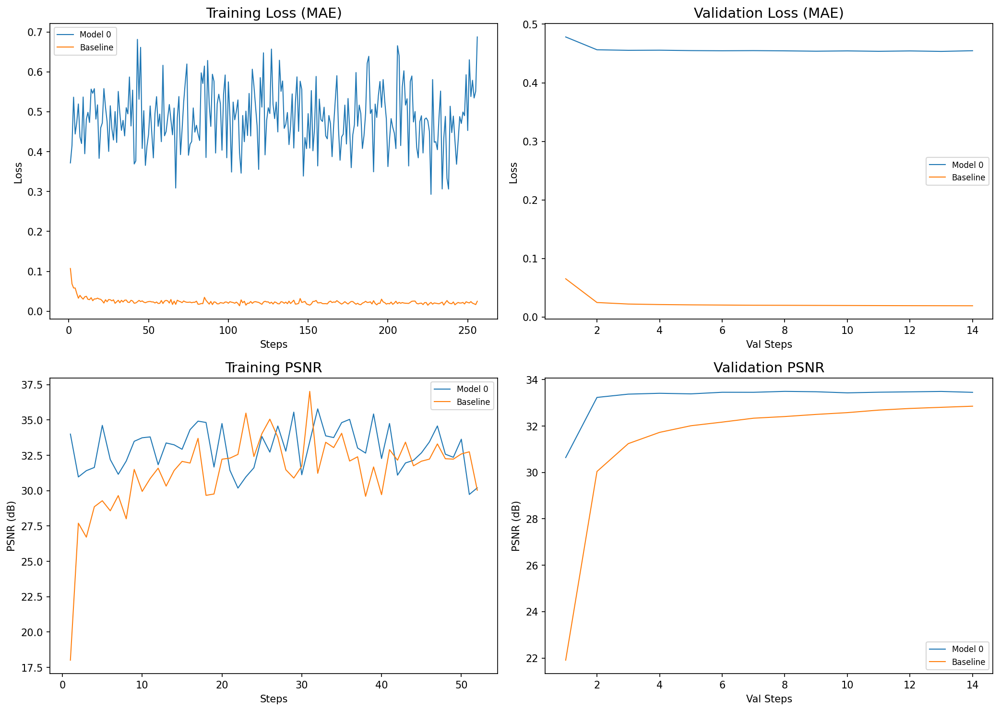

# VGG Replacement for Perceptual Loss
_I made a **loss function** that replaces the VGG for perceptual loss_

> [!NOTE]
> The internal implementation of the loss functions descibed here are ommited from this public repository. A description can be found below, but the exact logic is not disclosed here.

## First version
_This **first version** is specifically made only for **Image Super-Resolution** where semantic meaning in the loss function is **not necessary**_

The loss function has two streams(summed to get the final loss):
- The principal one is the L1Loss (Mean Absolute Error) weighted by a **feature map** that replaces the **functionalities of VGG**.
- The secondary one is a more sophisticated Multi Scale **gradient loss** that complements the first stream which would give **slightly ackward** results otherwise.

**Due to the first stream being much more less noisy the training is much more stable and therefore the network converges much faster and learns better**

[!NOTE] By tuning some parameters in the loss function a record of 21.3 -> ~30 PSNR(Peak Signal Noise Ratio) was achieved only in 10 steps. But the results shown here use the original default parameters which make the network achieve the same PSNR for step ~25

## Setup
Both networks and training parameters Same as the Baseline from the ColorMix benchmark but with:
- 5 residual blocks.
- a wider network with 42->28->42 channels.
- ~100K parameters each.

## Results
**Benchmark against pure L1Loss**


Model 0: The model using the new loss function,    Baseline: The model using L1 Loss

[!NOTE] Further results will be published later.

## Implementation Notes
- The image is cropped before any operation:
```python
    def forward(self, p, t):
        b = None # Not disclosed, but usually 2
        N = p.size(0)
        p_c = p[:,:,b:-b,b:-b]
        t_c = t[:,:,b:-b,b:-b]
```
- Padding is added to the target, default is 3
- Kernels Used for gradient loss:
```
        # Scharr Kernels
        kx = torch.tensor([[-3,0,3],[-10,0,10],[-3,0,3]], dtype=torch.float32).view(1,1,3,3).repeat(3,1,1,1)
        ky = torch.tensor([[-3,-10,-3],[0,0,0],[3,10,3]], dtype=torch.float32).view(1,1,3,3).repeat(3,1,1,1) # kx transposed
```
- The loss function has a total of 6 parameters, 3 of which are critical, and 1 that depends on the size of the images in the dataset which should be chosen carefully.
